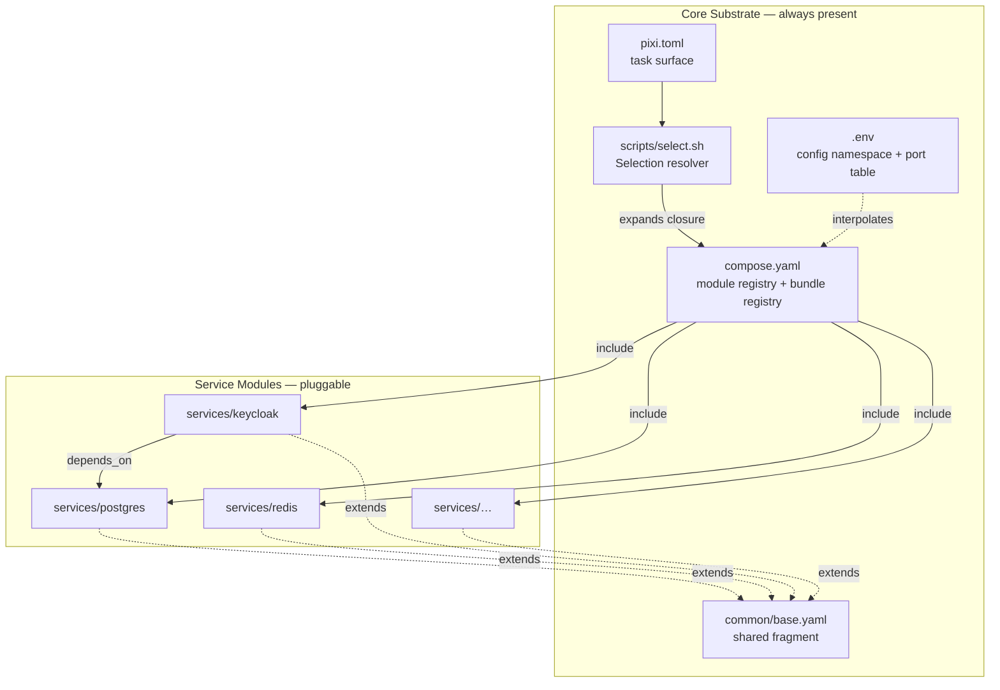
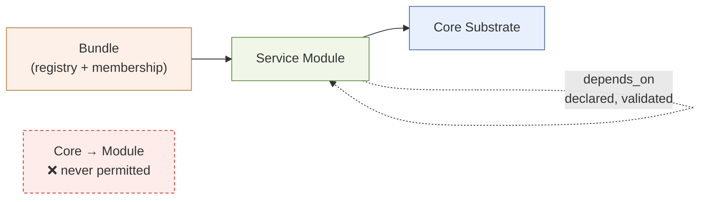
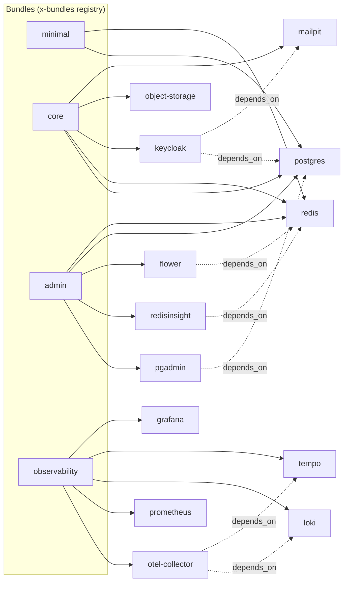

# Architecture Spine — devinfra

## Design Paradigm

**Microkernel (plug-in).** A minimal, non-optional **Core Substrate** plus interchangeable **Service Modules** that plug into it.

This is not a stylistic choice — verified Compose mechanics force it. Network identity, volume identity, host-port allocation, and the environment-variable namespace cannot be module-private, while service definitions can. That split *is* the microkernel boundary, and most of the rules below exist to keep things on the correct side of it.

| Layer | Owns | Lives in |
| --- | --- | --- |
| **Core Substrate** | The Module registry, the shared service fragment, the `devinfra` network, the configuration namespace, volume identity, the host-port allocation table, the Bundle registry, the Selection resolver, the task surface | `compose.yaml`, `common/`, `.env`, `pixi.toml`, `scripts/` |
| **Service Module** | Exactly one primary Service plus its declared helpers: Compose fragment, config assets, Seed Data, Smoke Test check, Gotchas | `services/<name>/` |
| **Bundle** | A named, dependency-closed set of Modules useful together | Names in the Core registry; membership declared per Module |

A Module may depend on the Core Substrate and, by declared `depends_on`, on other Modules. The Core Substrate never depends on a Module.



## Invariants & Rules

### AD-1 — Shared service configuration flows through `extends`, never YAML anchors

- **Binds:** FR-1, FR-2, every Module
- **Prevents:** A Module file that parses standalone but fails under `include`, or vice versa.
- **Rule:** No Module file may contain `<<: *alias` referencing an anchor defined in another file. Every Module service declares `extends: {file: ../../common/base.yaml, service: defaults}`. `common/base.yaml` is referenced only by `extends` and **never** appears in the `include` list.

*Verified: YAML anchors are document-scoped (YAML 1.2.2 §7.1); `include` is applied after YAML parsing. Upstream closed this "won't fix" (docker/compose#10912) and directs users to `extends` (docker/compose#12636). Multiple `-f` files do not rescue anchors either.*

### AD-2 — The shared base fragment declares no resource references, and never a restart policy for one-shots

- **Binds:** `common/base.yaml`, every Module
- **Prevents:** Every consumer of the base failing with `depends on undefined service`; and one-shot init containers inheriting `restart: unless-stopped` and restart-looping forever.
- **Rule:** `common/base.yaml` may declare only `restart`, `logging`, and `networks`. It must never declare `depends_on`, `links`, `volumes_from`, or `network_mode: service:*`. Any one-shot helper Service that extends the base **must** override `restart: "no"`.

*`extends` inherits those keys but does not import the resources they reference. The restart-loop was observed: the base's `unless-stopped` is inherited by init containers that exit 0 by design.*

### AD-3 — Cross-Module dependencies are `depends_on`, and that is the correctness gate

- **Binds:** FR-3, every Module with a dependency
- **Prevents:** A Selection that starts into a broken state, and a bespoke dependency resolver nobody maintains.
- **Rule:** Every cross-Module dependency is declared as `depends_on` with an explicit condition. Validation is `docker compose config -q`. No custom dependency resolver is written. A dependency not expressed as `depends_on` is unenforceable and therefore does not exist.
- **Known blind spot:** `config -q` does **not** detect host-port collisions — see AD-17.

*`depends_on` defaults to `required: true`, so Compose refuses an invalid Selection: `service "flower" depends on undefined service "redis": invalid compose project`, exit 1.*

### AD-4 — The configuration namespace has exactly two tiers

- **Binds:** FR-2, FR-10, FR-12, NFR-5, NFR-6, every Module
- **Prevents:** Two Modules silently claiming the same variable — and the specific unsolvable case where two Modules both legitimately need `AWS_ENDPOINT_URL`, a name the AWS SDK dictates and neither Module may rename.
- **Rule:** Every variable lives in the root `.env` and is one of exactly two kinds:
  - **Module variables** — named `<MODULE>_<CONCERN>` (`POSTGRES_PORT`, `REDIS_PASSWORD`). Read by any Module; owned by the one they are named for.
  - **Contract variables** — names dictated by an external contract and therefore unprefixable (`AWS_ENDPOINT_URL`, `AWS_ACCESS_KEY_ID`, `BIND_ADDRESS`, `COMPOSE_PROFILES`, `COMPOSE_PROJECT_NAME`). Each is listed in a Core-owned registry naming **exactly one owning Module**. CI fails if two Modules claim one, or if a Module uses an unregistered unprefixed name.

  Per-Module `.env` files are forbidden. A Module needing another's value reads the same variable, never a copy.

*Verified: a parent `.env` is visible inside included files and **wins** on conflict — a child `.env` is a fallback that can never override. The two-tier split exists because a single flat rule cannot express SDK-dictated names, and pretending otherwise makes FR-10 unimplementable: object storage and AWS emulation would both need to own `AWS_ENDPOINT_URL`.*

### AD-5 — Volume names are frozen, and a Module's volume stanza carries the identifier only

- **Binds:** NFR-1, FR-15, every stateful Module
- **Prevents:** Silent, total data loss — the unrecoverable class. A renamed volume is a *new* volume; the old one is orphaned and the Service starts empty with no error. And: a Module silently changing a Core-owned volume's driver.
- **Rule:** Named volumes keep their current identifiers (`postgres-data`, `keycloak-data`, `minio-data`, …) permanently. Renaming a Module never renames its volume — **the `object-storage` Module keeps the volume `minio-data`**, and the `<service-name>-data` convention yields to this rule wherever the two disagree. Freezing wins; tidiness does not. A Module's `volumes:` top-level stanza contains **the identifier and nothing else** — no `driver`, no `driver_opts`, no `attachable`. All such keys live in the Core `compose.yaml`. CI diffs every Module's declaration against Core and fails on any extra key. **A Module never declares the shared `networks:` stanza at all** (amended 2026-09-07): Core declares `devinfra` with `name` and `driver`, and Compose v2 rejects the whole model — `networks.devinfra conflicts with imported resource` — when any included file names a resource Core declares with keys. Newer Compose merges it, so the identifier-only form passes locally and fails every CI job. The general rule: a Module may name a top-level resource only when Core's declaration is bare. `scripts/assert_config.py` enforces this statically, on every Compose version.

*The naive form of this rule was tested and is false: root wins only on keys root explicitly sets. Every key root omits is last-include-wins, so a Module adding `driver_opts: {type: tmpfs}` silently wins, and **reordering the include registry can change a volume's driver**. Identifier-only is the only form that holds.*

### AD-6 — A Module validates together with its dependency closure

- **Binds:** FR-1, FR-6, and PRD Q1 (consumption model)
- **Prevents:** A validity check that passes while checking nothing, and a Module that cannot be lifted into another repository.
- **Rule:** For every Module, `COMPOSE_PROFILES=<module> docker compose $(closure -f flags) config -q` exits 0, where the closure is the Module's file plus the file of every Module in its transitive `depends_on` graph, computed by `scripts/select.sh` — never hand-maintained. No Module uses absolute paths, and none assumes the repository root is the Compose working directory. `project_directory` is not used.

*The naive "standalone-valid" form was tested and satisfiable only vacuously: with a profile on every service, `config` against one Module file returns `services: {}` and exits 0, validating nothing; activate the profile and it exits 1 on the undefined dependency. Closure-validity is what actually preserves the portability intent — you lift a Module **and what it needs**.*

### AD-7 — Bundle names are Core-owned; Bundle membership is Module-declared

- **Binds:** FR-2, FR-4, FR-16, NFR-7
- **Prevents:** Bundle membership drifting from what starts — and CI having nothing to enumerate.
- **Rule:** The set of valid Bundle names lives in one Core-owned registry (`x-bundles` in `compose.yaml`). Each Module service declares `profiles: [<module-name>, <bundle-name>…]`; a service starts when **any** of its profiles is active. `[ASSUMPTION: the four Bundles below — minimal, core, admin, observability — and which Modules join each are my proposal. Only admin and observability exist today.]` CI fails on a Bundle profile that appears in no registry entry, or a registry entry no Module joins.

*Profiles declared inside included files work from the parent, but cannot be attached at the `include` level (docker/compose#12296, open). Worse than unsupported: a `profiles:` key on an `include` entry is **silently ignored** — no error, and the service starts anyway. Membership must therefore be per-service — but `config --profiles` returns Module and Bundle profiles undifferentiated, so without a Core registry nothing can enumerate Bundles and AD-19's CI gate has no input.*

### AD-8 — A Module owns one primary Service plus explicitly declared helpers

- **Binds:** FR-6, FR-16, FR-18
- **Prevents:** A Compose service with no Module directory — invisible to the contract check, unreachable by the smoke runner. `minio-init` is the existing instance; a Kafka topic-initialiser and an OpenSearch Dashboards sidecar are the next two.
- **Rule:** `services/<name>/` contains `compose.yaml`, `smoke.sh`, `gotchas.md`, and either `seed/` or a `seed.none` file with a one-line justification `[ASSUMPTION: the sentinel-file mechanism is mine; any declaration CI can check would satisfy FR-6 equally]`; `conf/` when needed. Its `compose.yaml` declares a `healthcheck` on every long-running Service and an `x-endpoints:` block — the **Module metadata** naming each connection variable this Module publishes, which is the sole input to the generated Endpoint Contract documentation (FR-12). Together those five — healthcheck, smoke check, `x-endpoints`, seed declaration, gotchas — are FR-6's completeness contract in full.

  A Module may declare helper Services beyond its primary one; each helper is named `<module>-<role>` and **must carry a profile set identical to its primary's**. The AD-8 CI check runs **both directions**: every Module directory maps to a Service, and every Service in `config --services` maps to a Module. Presence checks are declaration-based, never a judgment of whether Seed Data was "needed".

*A helper whose profiles differ from its primary's produces an unseeded Service that passes startup and fails its smoke check.*

### AD-9 — pixi is the single task surface and provisions all validation tooling

- **Binds:** FR-16, FR-19, NFR-6, PRD Q8
- **Prevents:** A validation step that silently degrades to a no-op and still reports success — today `make lint` exits 0 on a machine lacking `shellcheck` or PyYAML.
- **Rule:** Tasks are defined in `pixi.toml`. Every validation tool (`shellcheck`, `yamllint`, `python`, `jq`) is a pinned pixi dependency, so a missing tool is impossible rather than skipped. **No task may branch on `command -v`.** Non-trivial shell lives in `scripts/*.sh` invoked by pixi tasks, never inline in a recipe. The `Makefile` is retained only as a deprecation shim forwarding to pixi. `[ASSUMPTION: PRD Q8 asked the question and did not answer it. That pixi wins is my call — the shim's survival past one release, and whether `pixi run up` replacing `make up` is acceptable at all, are both unconfirmed.]`

### AD-10 — Smoke Test checks are Module-owned and driven by the resolved Selection

- **Binds:** FR-5, FR-6, FR-16
- **Prevents:** A central smoke script edited on every Module addition; checks run against unselected Services; and a runner that reports all-pass having run nothing.
- **Rule:** Each Module owns `services/<name>/smoke.sh`, exiting 0 or non-zero and emitting only its own checks. The runner takes the **resolved Selection** from `scripts/select.sh` (AD-16) — the single source of truth — and runs exactly those Modules' scripts. **The runner fails if the resolved Selection is empty.** A check must exercise real function — mint a token, round-trip an object, publish and consume — never liveness.

### AD-11 — Image tags stay in `.env` and carry Renovate annotations

- **Binds:** FR-17, NFR-4
- **Prevents:** Tag drift going unnoticed, and an update bot that is configured but silently matches nothing.
- **Rule:** Every *pulled* image reference keeps the form `image: <repo>:${<MODULE>_VERSION:-<pinned>}`, with the version variable in the root `.env` immediately preceded by `# renovate: datasource=docker depName=<repo>`. Updates run through Renovate `customManagers` regex over `.env`. No Service resolves to a floating tag. Version variables are Module variables under AD-4 and are exempt from nothing.
  A *built* image (AD-22) satisfies this rule through its `Dockerfile` instead: its base tag and every installed package version are pinned there and tracked by Renovate on the same terms. The obligation is identical — pinned and tracked — only its location differs.

*Renovate's docker-compose manager **skips** `repo:${VAR:-tag}` — it handles only whole-image `${VAR:-repo:tag}`. Dependabot cannot read `.env` at all and has no custom-manager escape hatch.*

### AD-12 — Cross-Module state mutation follows stop → write → restart

- **Binds:** FR-15, FR-18, NFR-1, NFR-5
- **Prevents:** Two paths writing one Module's state with no ordering rule — the class that produces silent partial restores and stale caches.
- **Rule:** Any operation writing state a *different* Module owns must stop that Module's dependents, perform the write, then restart them. This governs every such path, not just realm import:
  - **Realm reimport** — `kc.sh import --override --http-management-port <free port>`, then restart the container. It never drops the `keycloak` database. The restart is mandatory, not optional: the import commits to the database while the running server keeps serving cached realm data.
  - **Postgres restore** — a `pg_dumpall` restore rewrites *every* database including `keycloak`, so it must stop Keycloak and any other Postgres dependent first and restart them after. `psql` runs with `ON_ERROR_STOP=1`.
  - A Module may declare `pre-restore` / `post-restore` hooks; Core scripts invoke them.

*Today's restore pipes into `psql -d postgres` with no `ON_ERROR_STOP`, so it exits 0 when `DROP DATABASE keycloak` fails on open connections — a silent partial restore, and a direct NFR-5 violation.*

### AD-13 — The observability Bundle stays five containers

- **Binds:** FR-13, NFR-7, PRD Q5
- **Prevents:** Trading tuned, working infrastructure for a bundle that is newer in packaging but older in contents.
- **Rule:** The `observability` Bundle keeps the OTel Collector, Prometheus, Loki, Tempo and Grafana as separate Modules with their existing configs. `grafana/otel-lgtm` is not adopted. Weight is addressed by Selection — not starting the Bundle — not by replacing it.

*The durable reason is the two solved gotchas — Loki's `allow_structured_metadata` and Tempo span metrics needing Prometheus remote-write — which `otel-lgtm` would discard, plus SM-C1 making catalog growth a counter-metric. `otel-lgtm:0.32.1` does bundle the same five components at older pins (Grafana 13.2.0, Collector 0.159.0), but that gap is roughly two days of release timing on a weekly-cadence repo and should not be leaned on: it is true today and probably false next month.*

### AD-14 — A Module declares what it needs from another Module

- **Binds:** FR-6, FR-7, FR-8, FR-9, FR-10
- **Prevents:** A requirement that lives only in the *provider's* configuration, where an innocent edit breaks a consumer with no config-time error.
- **Rule:** A Module needing a resource another Module provisions — a database, a bucket, a topic — declares it in **its own** file as an `x-requires:` block (`x-requires: {database: keycloak}`). CI reconciles every `x-requires` against the providing Module's configuration and fails on a mismatch. A Module never edits another Module's file to satisfy its own need.

*`POSTGRES_EXTRA_DATABASES=keycloak,app_test` lives in the Postgres namespace but its value is dictated by Keycloak's `KC_DB_URL`. Removing `keycloak` from that list is a legal edit under every other rule and breaks Keycloak silently. This recurs for any Module using Postgres or object storage for its own persistence.*

### AD-15 — Dependency direction

- **Binds:** all
- **Prevents:** A Core Substrate that cannot be reasoned about because a Module reached back into it.
- **Rule:** Dependencies point inward only. A Module never edits another Module's file, and never edits Core Substrate files except to add its own entry to the include registry, its own identifier-only volume declaration, its own port-table row, and its Bundle membership.



### AD-16 — Selection is resolved to its dependency closure before Compose sees it

- **Binds:** FR-2, FR-3, FR-4, UJ-2
- **Prevents:** The PRD's headline use case failing. Selecting `keycloak` alone exits 1 because Postgres does not carry the `keycloak` profile — and it cannot be made to without Keycloak editing Postgres's file, which AD-15 forbids.
- **Rule:** `scripts/select.sh` expands a requested Selection into its transitive `depends_on` closure and emits the resulting `COMPOSE_PROFILES` value. Every task that invokes Compose goes through it. **Every registered Bundle must already be closed** — CI asserts this, so a Bundle never relies on runtime expansion. Within this repository the resolver is the supported entry point, and a raw `docker compose --profile <module>` that bypasses it failing loudly is correct behaviour rather than a defect. This does **not** foreclose PRD Q1: a consuming repository composes the Module closure itself (AD-6 makes that closure computable) or vendors `select.sh`, which is a Core script deliberately free of repo-specific paths.

### AD-17 — Host ports are allocated from one Core-owned table

- **Binds:** NFR-2, FR-6, FR-16
- **Prevents:** Two Modules binding one host port. `config -q` passes; `up` half-starts the Selection and reports `Bind for 127.0.0.1:<p> failed: port is already allocated`, leaving AD-3's gate green.
- **Rule:** Every published host port is a Module variable with a default assigned from a Core-owned allocation table in `.env.example`. CI parses `docker compose config --format json` for every Bundle and fails on any duplicate `published` value. A new Module takes the next free range; it never picks a port ad hoc.

*Live collisions this prevents: `KEYCLOAK_MGMT_PORT` defaults to 9000, MinIO's natural port is also 9000 (dodged today only by an undocumented shift to 9100/9101), and SeaweedFS — a named replacement candidate — defaults its volume server to 8080, which is `KEYCLOAK_PORT`.*

### AD-18 — The default Selection is never empty

- **Binds:** FR-2, FR-16, NFR-3
- **Prevents:** A behaviour regression and a green CI that tested nothing. With a profile on every service and `COMPOSE_PROFILES` unset, `up` starts nothing and exits 0.
- **Rule:** `.env.example` ships a `COMPOSE_PROFILES` default containing at least the `core` Bundle, and `scripts/select.sh` fails loudly on an empty resolved Selection rather than proceeding. The modularization step's acceptance bar is that a default `up` starts the same Services it starts today.

*Unavoidable breaking change: today the five core Services carry no profile and therefore always start. Giving every Service a profile is what makes Selection possible, so a bare `docker compose up` with no `COMPOSE_PROFILES` set changes from "starts the core five" to "starts nothing, exit 0". Anyone whose `.env` predates this must add the variable. This belongs at the top of the migration notes.*

### AD-19 — CI fails loudly or not at all

- **Binds:** FR-16, FR-19, NFR-5, NFR-6
- **Prevents:** The exact defect this whole phase exists to fix, reintroduced one layer up.
- **Rule:** No CI step may skip a check because a tool, service, or fixture is unavailable — it fails. CI iterates **every Module** and **every Bundle in the `x-bundles` registry**, running for each: `docker compose config -q` over the AD-6 closure, the AD-8 bidirectional module check, the AD-17 port check, the AD-5 volume-stanza check, the AD-14 `x-requires` reconciliation, the AD-20 admission check, and the Smoke Test. Iterating Modules as well as Bundles is load-bearing — OpenBao, the broker and the search Service each arrive belonging to no Bundle, and a Bundle-only sweep would never validate them. A full run completes within 15 minutes. `[ASSUMPTION: the 15-minute budget is inherited from the PRD and unconfirmed; if a full sweep exceeds it, tier the matrix rather than dropping checks.]`

### AD-20 — Catalog admission policy

- **Binds:** FR-7, FR-8, FR-9, FR-10, NFR-8, PRD §5
- **Prevents:** The Catalog acquiring a Service that cannot be redistributed, that needs an account to start, that demands privileged host access, or that quietly drags the Stack toward looking deployable. Two Module authors could easily choose incompatibly here, and by the time it is noticed the Service is wired in.
- **Rule:** A Service is admitted to the Catalog only if **all** hold:
  1. **OSI-approved license.** No BUSL, no source-available, no proprietary. **HashiCorp Vault is named and excluded**; OpenBao is its replacement.
  2. **No account, token, or license key** is required to pull or start it.
  3. **No privileged host access** — in particular no `/var/run/docker.sock` mount, no `privileged: true`.
  4. **Actively maintained upstream.** An archived project may be retained only with a written, dated acceptance in its `gotchas.md` naming the unpatched advisories.

  And the security posture is **fixed, not improved**: trivial credentials, no TLS, `start-dev` Keycloak, anonymous Grafana admin, and `synchronous_commit = off` are correct for the stated purpose. No AD, Module, or Bundle may partially harden the Stack — a stack that is *almost* safe to deploy is more dangerous than one that obviously is not. Hardening changes are rejected on principle, not weighed.

*This is what disqualified LocalStack (non-commercial-only free tier, auth token, Docker socket) and what makes MinIO's archival a decision rather than a shrug. Without it as an invariant, NFR-8 and PRD §5 are governed by nothing.*

### AD-21 — Core scripts are verified like code, not trusted like config

- **Binds:** FR-3, FR-5, FR-15, FR-16, NFR-1
- **Prevents:** The Selection resolver, the closure computation, and the restore protocol — the three places where a bug is silent and expensive — being the only unverified things in a repository whose entire pitch is verified infrastructure.
- **Rule:** Every script in `scripts/` is `shellcheck`-clean and has at least one test exercising its contract. `select.sh` is tested for: closure correctness over the dependency graph, refusal of an empty Selection, and refusal of an unknown Module or Bundle name. `restore.sh` is tested for the stop → write → restart ordering of AD-12. These tests run in CI under AD-19 and may not be skipped.

*`select.sh` is load-bearing for AD-6, AD-10, AD-16 and AD-18. An error in it is indistinguishable from a correct run right up until data is missing.*

### AD-22 — A built image is pinned twice, built locally, and never published

- **Binds:** FR-21, NFR-3, NFR-4, AD-11, AD-19
- **Prevents:** Two developers on the same commit getting different images — the exact drift AD-11 prevents for upstream images, reintroduced through the back door of a build. `apt-get install <pkg>` resolves to whatever the repository publishes today; a build is only as reproducible as its least-pinned line.
- **Rule:** A Module builds an image only when no upstream image provides the capability; until FR-21 there were none, and this remains the exception rather than a pattern.
  - The `Dockerfile` lives in the Module directory it belongs to, like every other Module asset (AD-8).
  - **Both the base image tag and every package version are pinned explicitly** — `apt-get install -y <pkg>=<exact-version>`, never a bare package name. An unpinned install makes the image unreproducible and violates NFR-4 regardless of how carefully the base is pinned.
  - The image is **built locally and never published to a registry.** devinfra distributes no artifacts; the consumption model is a standalone checkout (Deferred, resolved), and publishing would create a release surface the project does not otherwise have.
  - The built image carries a local name derived from the Module, so two Modules cannot collide on one tag.
  - CI builds it, and the Smoke Test runs against the built image rather than the base (AD-19).
  - Renovate tracks the base tag **and** the pinned package version; a build hides its dependencies from AD-11 otherwise.
  - The first build's cost is excluded from the NFR-3 startup budget, which is defined on a warm cache; a cold build is a cold-cache cost like an image pull.

*Introduced by FR-21: Apache AGE and pgvector must share one Postgres instance, and no trustworthy image bundles both — the two community images have 3 and 4 stars, and one carries no licence at all, failing AD-20.*

## Consistency Conventions

| Concern | Convention |
| --- | --- |
| Module directory | `services/<service-name>/` — lowercase, hyphenated, matching the primary Compose service name exactly |
| Helper service name | `<module>-<role>` (e.g. `minio-init`), profile set identical to its primary (AD-8), `restart: "no"` (AD-2) |
| Container name | `devinfra-<service-name>` (existing pattern, preserved) |
| Volume name | `<service-name>-data` for new Modules; **existing names are frozen and take precedence** (AD-5). `object-storage` keeps `minio-data`. |
| Profile names | Module profile = the service name; Bundle profiles are nouns (`core`, `admin`, `observability`) registered under `x-bundles` |
| Module variables | `<MODULE>_<CONCERN>`, uppercase, root `.env` only (AD-4) |
| Contract variables | Unprefixed, SDK- or tool-dictated, listed in the Core registry with one owning Module (AD-4) |
| List-valued variables | Comma-separated, no spaces, no trailing comma (`POSTGRES_EXTRA_DATABASES`, `MINIO_BUCKETS`). One encoding, everywhere |
| Port publishing | `"${BIND_ADDRESS:-127.0.0.1}:${<MODULE>_PORT:-<allocated>}:<container-port>"` — bind address always first (NFR-2), default from the AD-17 table |
| Image reference | `image: <repo>:${<MODULE>_VERSION:-<pinned>}` with a `# renovate:` annotation on the variable (AD-11) |
| Relative paths | Always relative to the Module's own directory; `project_directory` is never used (AD-6) |
| Healthcheck | Every long-running Service declares one with a `start_period`; dependents use `condition: service_healthy` |
| Smoke check exit | 0 pass, non-zero fail; the runner decides what to skip, the check never skips itself |
| Shell scripts | `scripts/*.sh` and `services/*/smoke.sh`, `set -euo pipefail`, shellcheck-clean under CI (AD-9) |
| Config file mounts | `:ro` always |
| Built images | `Dockerfile` in the Module directory; base tag and every package version pinned; local name derived from the Module; never published (AD-22) |
| Gotcha entries | Symptom, cause, fix, affected versions — four fields, in the Module's `gotchas.md` |

## Stack

Verified current as of 2026-09-06. The code owns these once they exist; this is the cold-start pin.

| Name | Version |
| --- | --- |
| Docker Compose (floor) | 2.20 (for `include`); current release 5.5.1 |
| — | `[ASSUMPTION: RedisInsight 2.70→3.8, Tempo 2.9→3.0 and Grafana 12→13 are MAJOR bumps. They are pinned here as current, not as verified-compatible with this stack's configs. Each needs its own smoke run before merge — the Tempo and Grafana pair especially, since the span-metrics wiring spans both.]` |
| pixi | 0.79.0 |
| prefix-dev/setup-pixi | 0.10.2 |
| Renovate | `customManagers` regex over `.env` |
| pgvector/pgvector (base for the built Postgres image) | 0.8.6-pg17 |
| postgresql-17-age (PGDG package, pinned in the Dockerfile) | 1.7.0 |
| redis | 8.10.1 |
| quay.io/keycloak/keycloak | 26.7.3 |
| axllent/mailpit | v1.31.1 |
| dpage/pgadmin4 | 9.17 |
| redis/redisinsight | 3.8.0 |
| mher/flower | 2.1.0 |
| otel/opentelemetry-collector-contrib | 0.160.0 |
| prom/prometheus | v3.14.0 |
| grafana/loki | 3.7.7 |
| grafana/tempo | 3.0.3 |
| grafana/grafana | 13.2.1 |
| openbao/openbao | 2.6.2 |
| pgsty/silo (object storage) | RELEASE.2026-09-03T13-18-01Z |

## Structural Seed

```text
devinfra/
  compose.yaml              # Core: include registry, x-bundles registry,
                            #       identifier+driver volume and network declarations
  .env / .env.example       # Core: config namespace, port allocation table,
                            #       contract-variable registry, renovate annotations
  pixi.toml                 # Core: task surface + pinned validation tooling (AD-9)
  Makefile                  # deprecation shim forwarding to pixi
  common/
    base.yaml               # shared fragment, consumed by extends only (AD-1, AD-2)
  services/
    postgres/
      compose.yaml          # identifier-only volume stanza (AD-5), x-requires (AD-14)
      Dockerfile            # base + AGE, both pinned (AD-22) — the only image devinfra builds
      conf/postgresql.conf
      seed/                 # initdb scripts
      smoke.sh              # module-owned check (AD-10)
      gotchas.md
    redis/ keycloak/ mailpit/ object-storage/ openbao/
    pgadmin/ redisinsight/ flower/
    otel-collector/ prometheus/ loki/ tempo/ grafana/
  scripts/
    select.sh               # Selection → dependency closure → COMPOSE_PROFILES (AD-16)
    wait-healthy.sh         # extracted from the Makefile recipe
    smoke.sh                # runs module checks for the resolved Selection (AD-10)
    check-modules.sh        # AD-8 bidirectional contract check
    check-ports.sh          # AD-17 duplicate published-port check
    check-volumes.sh        # AD-5 identifier-only diff against Core
    backup.sh restore.sh    # FR-15, stop → write → restart (AD-12)
  examples/                 # FR-14 worked example
  .github/workflows/ci.yml
  docs/adr/
```

Bundle composition — every Bundle is dependency-closed (AD-16):



## Capability → Architecture Map

| Capability / Area | Lives in | Governed by |
| --- | --- | --- |
| FR-1 Per-Service Modules | `services/<name>/` | AD-1, AD-6, AD-8 |
| FR-2 Selection | `scripts/select.sh` + `COMPOSE_PROFILES` | AD-16, AD-7, AD-18, AD-21 |
| FR-3 Dependency validation | `docker compose config -q` | AD-3, AD-17, AD-21 |
| FR-4 Bundles | `x-bundles` + per-service `profiles:` | AD-7, AD-16 |
| FR-5 Modular Smoke Test | `services/*/smoke.sh` + `scripts/smoke.sh` | AD-10 |
| FR-6 Module completeness | `scripts/check-modules.sh` | AD-8, AD-14 |
| FR-7/8/9/10 New Services | new `services/<name>/` | AD-20 (admission), AD-4, AD-8, AD-14, AD-17 |
| FR-12 Endpoint Contracts | generated from `.env` + each Module's `x-endpoints` block | AD-8, AD-4, AD-17 |
| FR-13 Grafana dashboards | `services/grafana/seed/` | AD-13, AD-10 |
| FR-14 Worked example | `examples/` | AD-4 |
| FR-15 Backup coverage | `scripts/backup.sh`, `restore.sh` | AD-12, AD-5, AD-21 |
| FR-16 CI | `.github/workflows/ci.yml` | AD-19, AD-9 |
| FR-17 Dependency currency | `.env` annotations + Renovate config | AD-11 |
| FR-18 Gotcha Register | `services/*/gotchas.md` | AD-8, AD-12 |
| FR-19 Runtime portability | `.github/workflows/ci.yml` runtime matrix | AD-19, AD-9 |
| NFR-1 Data durability | volume declarations, restore protocol | **AD-5**, AD-12 |
| NFR-2 Isolation | port publishing convention | AD-17, Conventions |
| NFR-3 Startup | `scripts/wait-healthy.sh` | AD-9, AD-18 |
| NFR-4 Reproducibility | pinned tags | AD-11 |
| NFR-5 Fail loud | required-variable syntax, `ON_ERROR_STOP=1`, non-empty Selection | AD-12, AD-18, AD-19 |
| NFR-6 Configuration honesty | `config -q` asserted in CI | AD-19, AD-4 |
| NFR-7 Resource cost stated | Bundle documentation | AD-7 |
| NFR-8 Security posture fixed | admission + posture rules | **AD-20** |

## Deferred

- ~~**The S3-compatible object storage Service.**~~ **RESOLVED — adopted `pgsty/silo`.** MinIO and `minio/mc` were both archived upstream, and the final MinIO release fixed a privilege-escalation CVE that was never published to any registry. Silo preserves the `MINIO_*` variables and the on-disk format, so this was an image swap with no data migration and the `minio-data` volume was untouched (AD-5 held). Compatibility was verified **bidirectionally** against a copy of the live volume before any change, making the move reversible, and the full smoke suite passes — 45/0/0. The same image also supplies `mc`, retiring the second archived dependency. See `docs/adr/0008`. Residual risk is bus factor 1, mitigated by the verified format portability.

- ~~**The consumption model** (PRD Q1).~~ **RESOLVED — standalone checkout.** A project consumes the services devinfra provides and clones devinfra if they are not already running; consuming projects are never modified to embed it. The reusable-base and CLI paths are not pursued. AD-6's closure-validity still holds and keeps the reusable-base option reachable at no cost, but no AD now depends on it.
- **`keycloak-config-cli` for idempotent realm reconciliation.** AD-12 removes the pain that motivated it. Revisit if realm-as-code becomes a real workflow. Pin would be `6.5.1-26.5.5` — no `26.4.x` artifact exists.
- **Which product fills each Catalog category** (message broker, search). Each arrives as one Module under AD-8, so deferring costs nothing.
- **Multi-Stack / port allocation across concurrent Stacks.** AD-17 governs allocation *within* one Stack. Running two Stacks simultaneously is unaddressed and would become urgent only if the reusable-base consumption model is adopted.
- **Windows-native support.** AD-9 removes the Make dependency that was the main obstacle, but nothing here verifies it.
- **Podman is now the preferred runtime** (Docker Desktop licensing), so AD-19's CI matrix should treat Podman as primary rather than as the alternative. What remains deferred is which Services, if any, cannot work under it.
- **Versioning and release of the repository itself.** devinfra is consumed by `git clone`, so it has no release artifact and currently no tags. Deferred deliberately: it becomes a real question only if PRD Q1 resolves toward the reusable-base model, at which point a consuming repository needs something to pin. Recorded here so the silence is a choice rather than an oversight.
- **Secrets handling beyond the Stack's own posture.** AD-20 fixes the posture — credentials stay trivial and committed in `.env.example` by design. What is deferred is whether OpenBao (FR-9) becomes merely *a Service in the Catalog* or also *the mechanism by which other Modules obtain their credentials*. The second is a much larger change and nothing here assumes it.
