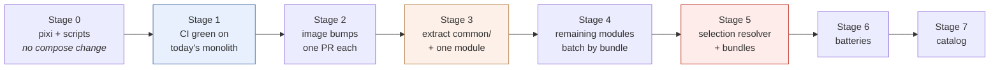

# Migration Plan — monolith to modules

Companion to [ARCHITECTURE-SPINE.md](ARCHITECTURE-SPINE.md). The spine says what must be true; this says how to get there from a 424-line `compose.yaml` without losing data or a working stack.

## The one rule that matters

**Named volumes are the only irreplaceable thing in this repository.** Everything else can be rewritten from the README in an afternoon. A renamed or re-driven volume orphans real data with no error message (AD-5).

Before starting, and again after each stage:

```sh
docker volume ls --filter name=devinfra --format '{{.Name}}' | sort > /tmp/volumes-before.txt
# ... perform the stage ...
docker volume ls --filter name=devinfra --format '{{.Name}}' | sort | diff /tmp/volumes-before.txt -
```

A non-empty diff at any point means stop and understand why. New volumes are suspicious; missing ones are an emergency.

Take a real backup before Stage 2 — not just Postgres:

```sh
make backup                                     # Postgres
docker run --rm -v devinfra_minio-data:/d -v "$PWD/backups:/b" alpine \
  tar czf /b/minio-data.tgz -C /d .             # objects
make keycloak-export                            # realm to JSON
```

## Stage order, and why

The PRD's confirmed sequence is durability → modularity → batteries → catalog. Two refinements the architecture forces:

1. **PRD Q8 (Make vs pixi) is settled before any CI is written** — AD-9. CI authored against Make and then migrated is wasted work.
2. **The image-bump wave happens *after* CI exists and *before* the module split.** Three of the eleven stale pins are majors; discovering a Tempo 3.0 breakage while also debugging a file split is the worst possible ordering.



Stages 3 and 5 are the risky ones. Stage 5 is where behaviour visibly changes.

---

## Stage 0 — pixi owns the task surface

**Nothing about `compose.yaml` changes.** This stage exists to make Stage 1 meaningful.

1. `pixi init` at the repo root. Add `shellcheck`, `yamllint`, `python`, `jq` to a `dev` feature.
2. Extract from the `Makefile` into `scripts/`, one at a time, each verified by running it:
   - the `wait` target's 60-iteration health loop → `scripts/wait-healthy.sh`
   - the `urls` printf block → `scripts/urls.sh`
   - the `destroy` and `keycloak-reimport` confirmation prompts → their own scripts
3. Define pixi tasks mirroring every current `make` target, using task `args` where Make used variables (`make psql DB=keycloak` → `pixi run psql keycloak`).
4. Rewrite `lint` so **nothing skips** (AD-9). Delete every `command -v` branch. This is the point of the stage.
5. Reduce the `Makefile` to forwarding targets that print a deprecation notice.

**Done when:** `pixi run lint` fails on a machine with no system `shellcheck` installed — because pixi supplies it and it actually ran — and every former `make` target has a working pixi equivalent.

**Rollback:** trivial; nothing outside `scripts/`, `pixi.toml` and the `Makefile` was touched.

---

## Stage 1 — CI green against the monolith

Still no `compose.yaml` change. CI must be proven against a known-good stack before it is asked to police a refactor.

1. `.github/workflows/ci.yml` using `prefix-dev/setup-pixi@v0.10.2`.
2. Jobs: `pixi run lint`, `docker compose config -q` for each profile combination, `up` + `wait-healthy` + `smoke` for the full stack.
3. Renovate: `customManagers` regex over `.env`, and add `# renovate: datasource=docker depName=<repo>` above every `*_VERSION` variable (AD-11).

**Done when:** CI is green on `main` with today's `compose.yaml`, and a deliberately broken PR (delete a service's `depends_on` target) goes red.

**Watch for:** the full stack on a hosted runner may exceed the 15-minute budget. If so, tier the matrix — never drop checks (AD-19).

---

## Stage 2 — the image-bump wave

Eleven stale pins, **one pull request each**, so a break is attributable. CI from Stage 1 is the safety net.

Order matters — trivial first, to build confidence in the harness:

| Order | Bump | Risk |
| --- | --- | --- |
| 1–7 | pgvector 0.8.6-pg17 · redis 8.10.1 · mailpit v1.31.1 · pgadmin4 9.17 · flower 2.1.0 · otelcol 0.160.0 · prometheus v3.14.0 | Low — patch/minor |
| 8 | **Keycloak 26.4.0 → 26.7.3** | Medium. Three minors, ~24 security fixes. Verify the realm import, the `roles` claim, and the `aud` still validate; `make token \| jq` is the check |
| 9 | **RedisInsight 2.70 → 3.8.0** | Medium — major. Verify the `RI_REDIS_*` auto-add variables still exist |
| 10–11 | **Loki 3.7.7, then Tempo 3.0.3 + Grafana 13.2.1 together** | **Highest.** Tempo 2→3 and Grafana 12→13 both touch the span-metrics path. Ship them as one PR precisely because the wiring spans both; the smoke test's OTLP round-trip is the gate |

**Done when:** every pin is current and `pixi run smoke` passes. Keep `docker/` configs unchanged in this stage — if a bump needs a config change, that is a finding worth its own commit.

---

## Stage 3 — extract the substrate and one module

The first structural change. Do it with **one** module so the pattern is proven cheaply.

1. Create `common/base.yaml` holding only `restart`, `logging`, `networks` (AD-2). It is **not** added to any `include` list.
2. Create `services/postgres/` — chosen first because it has no dependencies, so it isolates the mechanism from the closure problem.
3. Move `docker/postgres/*` → `services/postgres/conf/` and `services/postgres/seed/`. **Rewrite the bind-mount paths to be relative to the module file** (`../../docker/…` is wrong; the file now lives beside its config). Do not use `project_directory` (AD-6).
4. Volume stanza in the module file contains `postgres-data:` **and nothing else** (AD-5).
5. Root `compose.yaml` gains `include: [./services/postgres/compose.yaml]` and drops the inline `postgres:` block.

**Verify, in this order:**

```sh
docker compose config > /tmp/after.yaml     # compare against a `config` capture taken BEFORE
docker compose up -d postgres
psql ... -c 'select count(*) from ...'      # real data still present
docker volume ls --filter name=devinfra | diff /tmp/volumes-before.txt -
```

Comparing rendered `docker compose config` output before and after is the single highest-value check in the whole migration — the rendered model should be **identical** apart from key ordering.

**Rollback:** revert the commit. No volume was touched.

---

## Stage 4 — the remaining twelve modules

Batch by bundle so each PR is reviewable: core (redis, keycloak, object-storage, mailpit) → admin (pgadmin, redisinsight, flower) → observability (otel-collector, prometheus, loki, tempo, grafana).

Per module, in addition to Stage 3's steps:

- `depends_on` edges are preserved exactly (AD-3). They are now cross-file; Compose resolves them after include.
- `minio-init` moves into `services/object-storage/` as a declared helper, named per AD-8, with `restart: "no"` explicitly set — the base fragment's `unless-stopped` would otherwise make a one-shot container restart-loop (AD-2).
- The `object-storage` module keeps the volume `minio-data` (AD-5). Do not tidy this.
- Each module gains `smoke.sh` carved out of the corresponding section of `scripts/smoke-test.sh`, plus `gotchas.md` carved out of the README's Gotchas section, plus an `x-endpoints` block.

**Done when:** the rendered `docker compose config` still matches the pre-migration capture, `pixi run smoke` passes, and every volume is byte-identical in identity.

---

## Stage 5 — Selection, bundles, and the breaking change

This is the stage users notice.

**The breaking change, stated plainly:** today the five core services carry no profile and therefore always start. Making everything selectable means giving every service a profile — and a service *with* profiles does not start unless one is active. So a bare `docker compose up` goes from "starts the core five" to "starts nothing, exit 0" for anyone whose `.env` predates this.

Mitigations, all three:

1. `.env.example` ships `COMPOSE_PROFILES=core,admin,observability` (AD-18).
2. `scripts/select.sh` **fails loudly** on an empty resolved Selection rather than proceeding (AD-18) — this is what turns a silent no-op into an error message.
3. The README and the release notes lead with it.

Then:

- `x-bundles` registry in the root `compose.yaml` (AD-7).
- `scripts/select.sh` computing the transitive `depends_on` closure (AD-16), with tests (AD-21).
- The smoke runner switches to taking the resolved Selection as its single source of truth (AD-10).
- `scripts/check-ports.sh`, `check-volumes.sh`, `check-modules.sh` land and join CI (AD-19).

**Done when:** `pixi run up postgres redis` starts exactly two containers plus nothing else; `pixi run up keycloak` starts Keycloak *and* Postgres *and* Mailpit via closure expansion; and `COMPOSE_PROFILES= docker compose up` fails with a readable message rather than doing nothing.

---

## Stage 6 — batteries

Independent of each other; ship separately. Grafana dashboards (FR-13) · Endpoint Contract generation from `x-endpoints` (FR-12) · multi-service backup with the stop → write → restart protocol and `ON_ERROR_STOP=1` (FR-15, AD-12) · the non-destructive realm reimport (AD-12) · worked example (FR-14).

The realm reimport change is small and deletes a documented gotcha — good first pick.

---

## Stage 7 — catalog

Every new Service passes AD-20 admission before anything else. Then FR-6's five-item contract, a port from the AD-17 table, and `x-requires` for anything it needs from another Module (AD-14).

**Settle object storage first.** MinIO is archived with seven unpatched advisories; `pgsty/silo` is close to an image-name swap and SeaweedFS is the Apache-2.0 alternative. Doing this before adding new Services means the Module contract gets exercised on a replacement you already understand.

---

## If something goes wrong

| Symptom | Likely cause | Move |
| --- | --- | --- |
| Service starts empty, no error | Volume renamed or re-driven (AD-5) | Stop immediately. `docker volume ls` — the old volume is almost certainly still there under its original name. Do not `down -v` |
| `unknown anchor 'defaults' referenced` | A module still uses `<<: *defaults` (AD-1) | Convert to `extends: {file: ../../common/base.yaml, service: defaults}` |
| `depends on undefined service` | Selection not closed (AD-16) | Correct — go through `select.sh` rather than raw `--profile` |
| `config -q` passes, `up` half-starts with a port error | Port collision; `config` is blind to it (AD-17) | Add the module to the port table and run `check-ports.sh` |
| A bind mount points at a path that does not exist | Relative path not rewritten for the module's new directory (AD-6) | Rewrite the path; do not reach for `project_directory` |
| Realm changes do not appear after import | Server serving cached realm data (AD-12) | Restart the container — the write did land in Postgres |
| An init container restart-loops | Inherited `restart: unless-stopped` from the base (AD-2) | Set `restart: "no"` on the helper |
| `up` starts nothing, exit 0 | `COMPOSE_PROFILES` unset after Stage 5 | The expected breaking change. Set it in `.env` |
